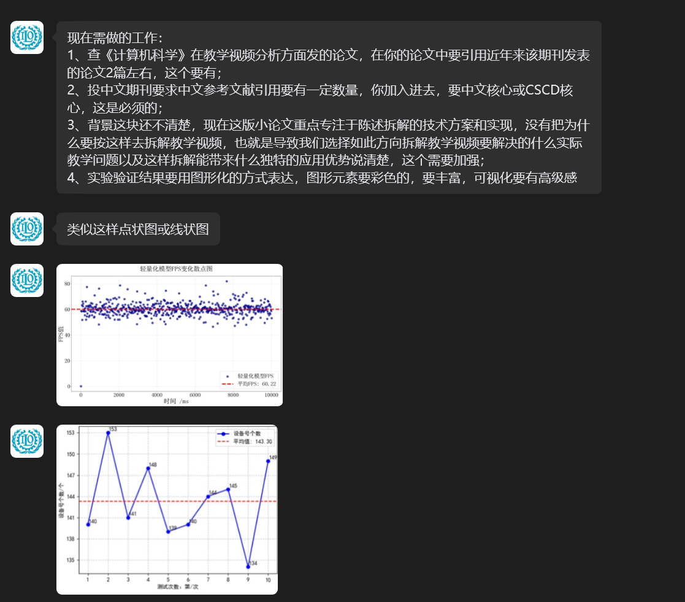

总体上质量很高。以下问题：
1，破折号和分号是不是少用。
2. 有的实验图是不是太小，如2，3，但是是不是NATURE就是这个风格啊
3. 图6怎么得大一点。因为不是趋势
4. 第一章的stage 1,2,3是不是写的稍微再通俗一点，我怕带入太快审稿人们不一定是专业方向的。除此之外，从创新角度出发，是不是也可以体现下创新性。
5. 不知道计算机论文那种算法伪代码图，如alg.1是否适用于nature风格
6. 4.5.2 下面又出现1，2，3，级别混乱了，建议改成实点
7. 实验代码是否可以公开放链接进去
8. introduction第一段感觉给的背景描述太少

